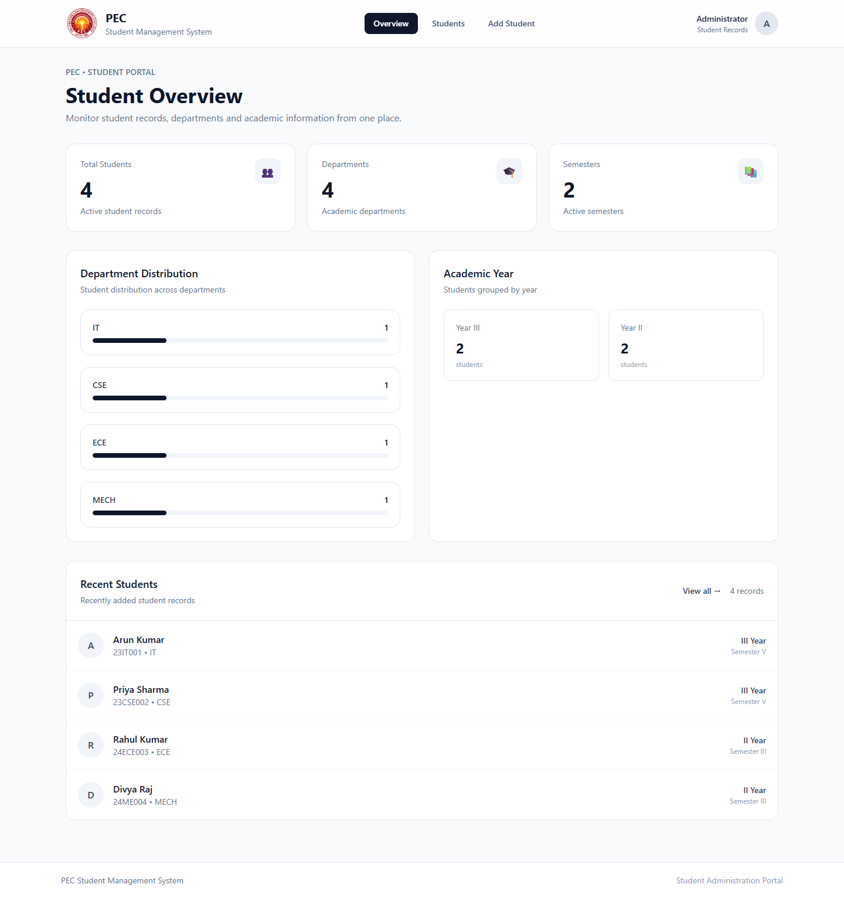

# PEC Student Management System

A responsive student records portal built with React, Vite, and Tailwind CSS. The dashboard summarizes student enrollment and department information, while the Students page supports searching, filtering, sorting, and managing student records.

## Student

**Name:** V. Sham

## Technologies Used

- React.js
- Vite
- JavaScript
- Tailwind CSS
- LocalStorage
- JSON / Dummy Data

## Features

### Dashboard

- Total student count
- Department-wise student information
- Academic year and semester information
- Recent student records
- Clickable department overview

### Student Management

- Add student records
- Edit student records
- Delete student records
- Delete confirmation dialog

### Search and Filtering

- Search by student name
- Search by register number
- Filter by department
- Filter by academic year
- Clear filters

### Sorting

- Sort by student name
- Sort by register number
- Ascending and descending order

### Validation

- Required field validation
- Email format validation
- 10-digit phone number validation
- Duplicate register number validation

### Data Storage
- Student records are initially loaded from `src/data/students.js`
- Changes are stored in browser `localStorage`
- Data remains available after refreshing the page

### Responsive Design

- Responsive layout for desktop, tablet, and mobile
- Card-based student directory
- Responsive student form
- Clean and user-friendly interface

## Requirements

- Node.js
- npm

## Run Locally

### 1. Install dependencies

```bash
npm install
```

### 2. Start the development server

```bash
npm run dev
```

### 3. Open the application

Open the local URL displayed in the terminal by Vite.

Usually: `http://localhost:5173`

## Available Commands

```bash
npm run dev
npm run build
npm run preview
npm run lint
```

## Project Structure

```text
src/
├── components/
├── data/
│   └── students.js
├── pages/
│   ├── Dashboard.jsx
│   ├── Students.jsx
│   └── AddStudent.jsx
├── App.jsx
└── main.jsx

public/
└── pec-logo.png
```

## Additional Features

- LocalStorage persistence
- Custom delete confirmation modal
- Department-based navigation from the dashboard
- PEC-branded interface
- Responsive card-based student directory
- Mobile-friendly forms

## Screenshots

### Dashboard



### Students


### Add Student


## Academic Project

This project was developed as a Student Management System for academic assessment purposes.
